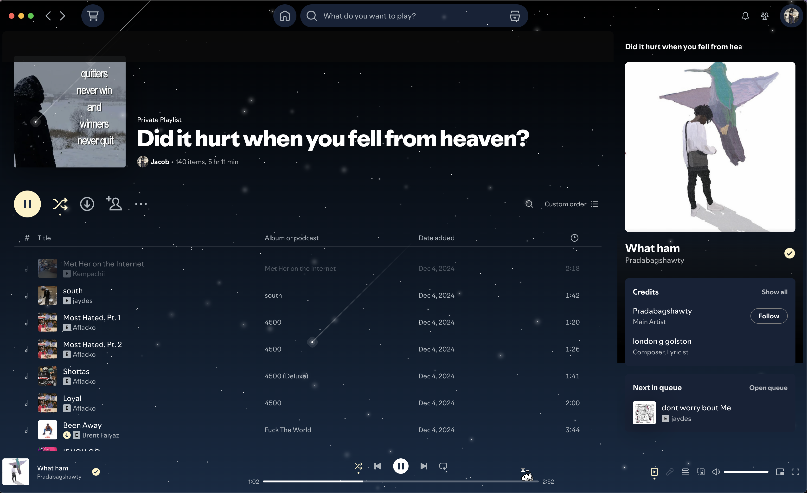
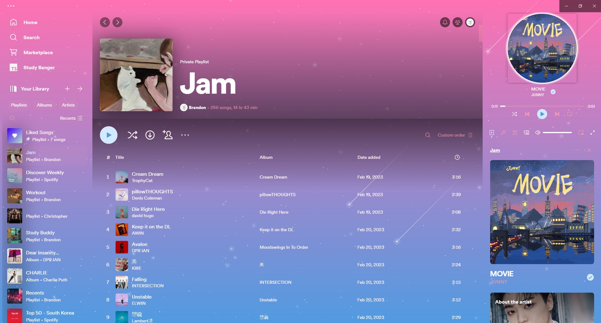
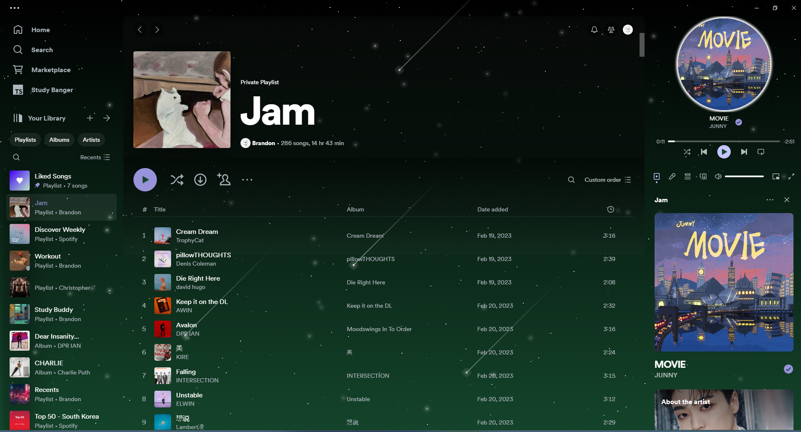
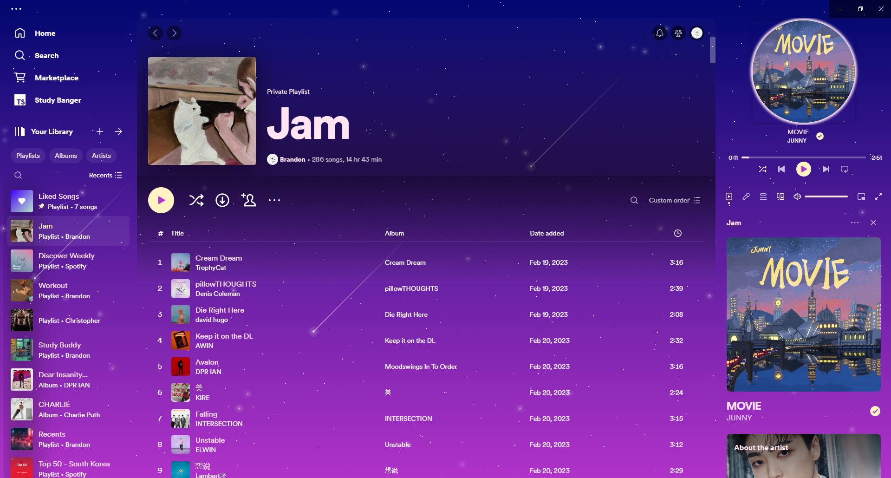
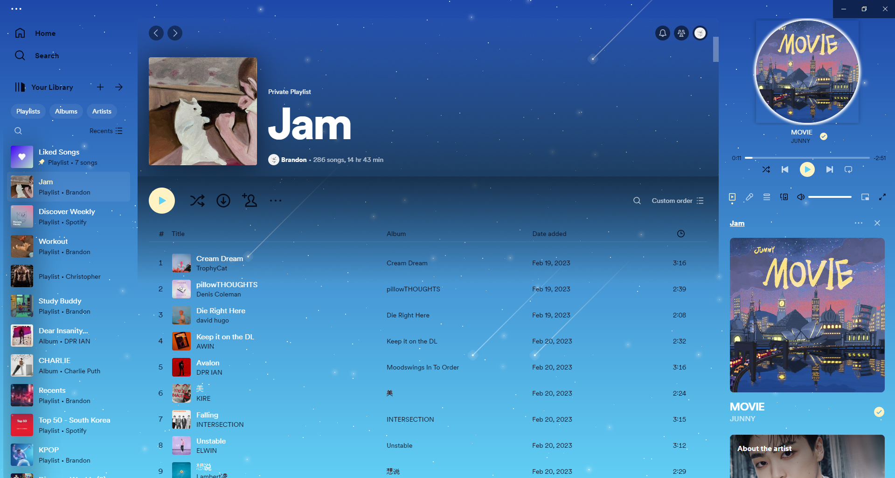
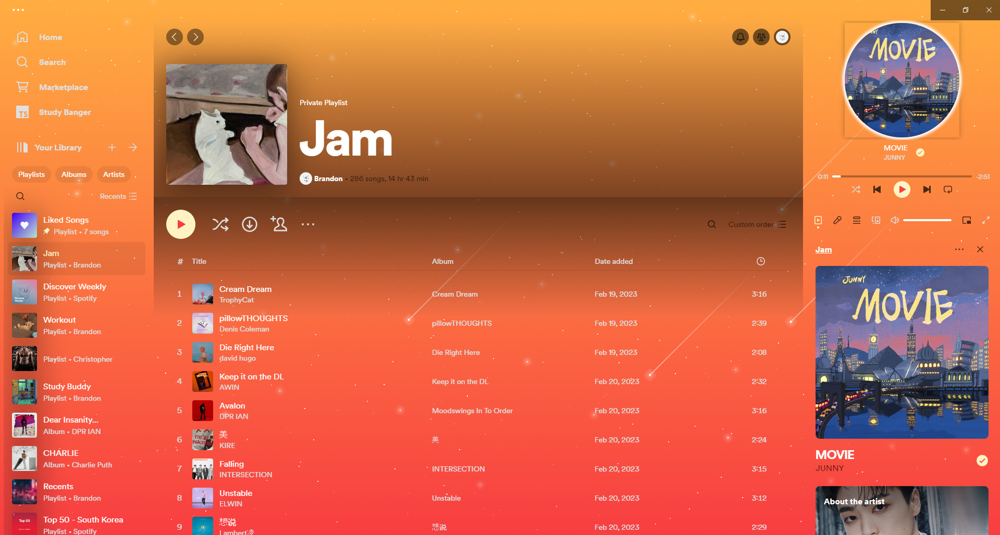

# StarryNight Mac - Spicetify Theme

A beautiful animated starry night theme for Spotify that transforms your music experience with cosmic backgrounds and celestial animations. This project is specifically optimized for macbook users as the original version has many visial bugs on mac.

## ✨ Features

- 🌌 **Animated starry night background** with gradient sky
- ⭐ **Twinkling stars** with randomized animations
- 🌠 **Shooting star effects** that streak across the screen
- 🎨 **7 gorgeous color schemes** to choose from
- 🔋 **Performance optimized** - animations pause when tabbed out
- 📱 **Clean interface** - preserves default Spotify layout while adding cosmic beauty
- 🎵 **Background-only design** - doesn't interfere with sidebar or playback controls

## 🎨 Color Schemes

| Scheme | Description |
|--------|-------------|
| **Base** | Classic dark blue starry night |
| **Cotton-candy** | Pink and purple gradient dream |
| **Forest** | Dark green nature theme |
| **Galaxy** | Purple space nebula |
| **Orange** | Warm orange sunset |
| **Sky** | Light blue daytime sky |
| **Sunrise** | Red and orange morning glow |

## 📸 Screenshots

### Base

### Cotton Candy

### Forest

### Galaxy

### Orange

### Sky

### Sunrise


## 🚀 Installation

### Prerequisites
- [Spicetify CLI](https://spicetify.app/docs/advanced-usage/installation) installed
- Spotify Desktop App

### Quick Install

1. **Download this theme:**
   ```bash
   git clone https://github.com/yourusername/StarryNight-Spicetify.git
   cd StarryNight-Spicetify
   ```

2. **Copy to Spicetify themes directory:**
   ```bash
   # macOS/Linux
   cp -r . ~/.config/spicetify/Themes/StarryNight
   
   # Windows
   cp -r . %APPDATA%\spicetify\Themes\StarryNight
   ```

3. **Apply the theme:**
   ```bash
   spicetify config current_theme StarryNight
   spicetify config color_scheme Base
   spicetify apply
   ```

### Manual Install

1. Download or clone this repository
2. Navigate to your Spicetify themes folder:
   - **macOS**: `~/.config/spicetify/Themes/` 
   - **Linux**: `~/.config/spicetify/Themes/`
   - **Windows**: `%APPDATA%\spicetify\Themes\`
3. Create a new folder called `StarryNight`
4. Copy all theme files into the folder
5. Run the apply commands above

## 🎛️ Customization

### Changing Color Schemes
```bash
spicetify config color_scheme [scheme_name]
spicetify apply
```

Available schemes: `Base`, `Cotton-candy`, `Forest`, `Galaxy`, `Orange`, `Sky`, `Sunrise`

### Performance Settings
The theme automatically pauses animations when Spotify is not in focus (tabbed out) to save system resources. This behavior is built-in and requires no configuration.

## ⚙️ Technical Details

### Animation Performance
- **Twinkling stars**: CSS animations with randomized timing
- **Shooting stars**: Continuous CSS animations with restart logic
- **Tab visibility detection**: Uses Page Visibility API to pause animations when not focused
- **Resource optimization**: Minimal DOM manipulation for best performance

### File Structure
```
StarryNight/
├── color.ini          # Color scheme definitions
├── user.css           # Main theme styles
├── theme.js           # Animation logic and tab visibility
├── images/            # Screenshot gallery
└── README.md          # This file
```

## 🔧 Troubleshooting

### Theme not applying
```bash
spicetify restore
spicetify apply
```

### Animations not visible
1. Restart Spotify completely
2. Check if hardware acceleration is enabled in Spotify settings
3. Try a different color scheme

### Performance issues
- Animations automatically pause when tabbed out
- Reduce the number of concurrent browser tabs
- Ensure your system meets Spotify's minimum requirements

## 🤝 Contributing

Contributions are welcome! Please feel free to submit a Pull Request. For major changes, please open an issue first to discuss what you would like to change.

### Development Setup
1. Fork this repository
2. Make your changes to the theme files
3. Test with `spicetify apply`
4. Submit a pull request

## 📄 License & Credits

### StarryNight Theme
This theme is open source and available under the MIT License.

### Shooting Star Animation
The shooting star effects are based on work by [Delroy Prithvi](https://codepen.io/delroyprithvi/pen/LYyJROR):

> Pure CSS Shooting Star Animation Effect Copyright (c) 2021 by Delroy Prithvi
> 
> Permission is hereby granted, free of charge, to any person obtaining a copy of this software and associated documentation files (the "Software"), to deal in the Software without restriction, including without limitation the rights to use, copy, modify, merge, publish, distribute, sublicense, and/or sell copies of the Software, and to permit persons to whom the Software is furnished to do so, subject to the following conditions:
> 
> The above copyright notice and this permission notice shall be included in all copies or substantial portions of the Software.

## 🌟 Support

If you enjoy this theme, please consider:
- ⭐ Starring this repository
- 🐛 Reporting bugs via GitHub Issues
- 💡 Suggesting new features
- 🔄 Sharing with other Spotify users

---

**Made with ❤️ for the Spotify community**

*Transform your music experience with StarryNight - where every song plays under a cosmic sky.*